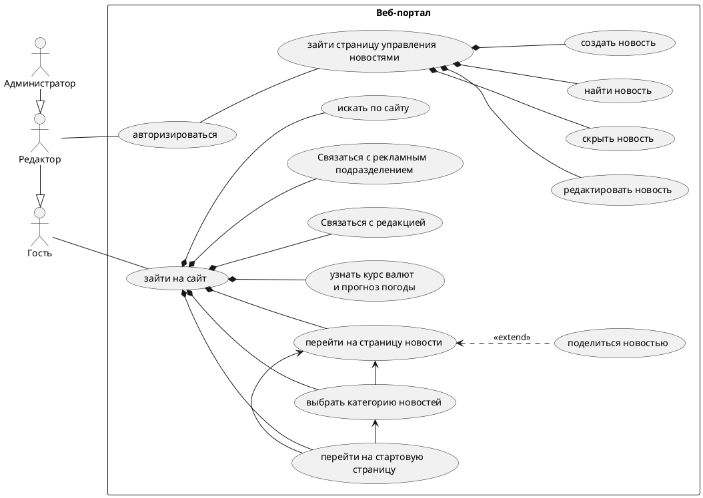

```plantuml
@startuml
left to right direction
actor Гость as гость
actor Редактор as редактор
actor Администратор as админ
админ -|> редактор
редактор -|> гость

rectangle Веб-портал {
''' Администратор '''


''' Редактор '''
(авторизироваться) as auth
редактор -- auth
(зайти страницу управления \n новостями) as private_main
auth -- private_main
private_main *-- (создать новость)
private_main *-- (редактировать новость)
private_main *-- (скрыть новость)
private_main *-- (найти новость)

''' Гость '''
(зайти на сайт) as enter
гость -- enter

(узнать курс валют \n и прогноз погоды) as info
(Связаться с редакцией) as contact
(Связаться с рекламным \n подразделением) as promo
enter *-- info
enter *-- contact
enter *-- promo
enter *-- (искать по сайту)

(перейти на стартовую \n страницу) as start
(перейти на страницу новости) as new
enter *-- start
start -> new
enter *-- new
new <.. (поделиться новостью) : <<extend>>


(выбрать категорию новостей) as category
start -> category 
enter *-- category
category -> new
  
}
@enduml
```